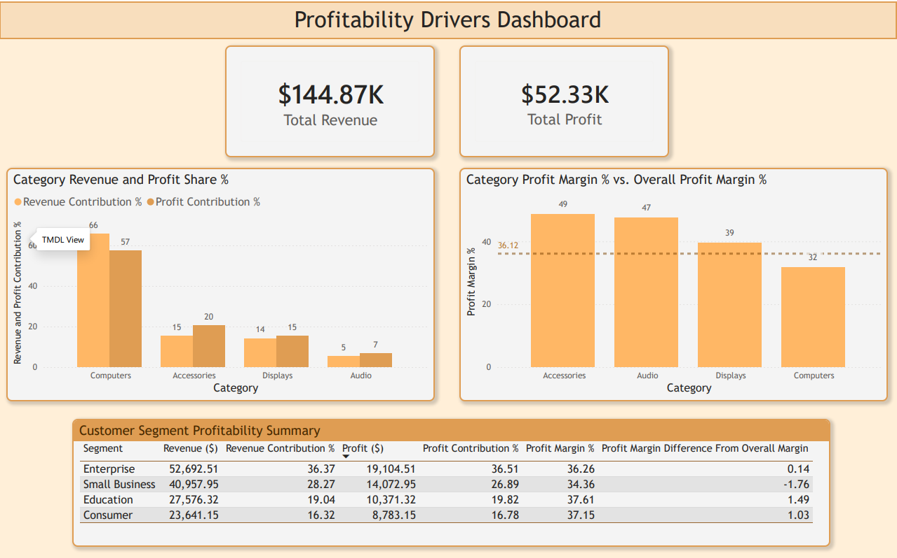

# Profitability Drivers Dashboard

## Objective

This mini project analyzes revenue, profit, and profit margin drivers by product category and customer segment.

The goal was to practice an end-to-end workflow:

SQL analysis → CSV exports → Power BI dashboard → business summary

## Tools Used

- Python
- pandas
- SQLite
- SQL
- Power BI

## Dashboard Preview



## Business Questions

1. Which product categories drive the most revenue and profit?
2. Which product categories have the strongest profit margins?
3. Which customer segments contribute the most revenue and profit?
4. Which areas appear to be scale drivers versus efficiency drivers?

## Key Insights

- Computers generated the largest share of revenue and profit, contributing about 66% of total revenue and 57% of total profit.
- Computers had the weakest profit margin at about 32%, which was below the overall profit margin of 36.12%.
- Accessories and Audio contributed much less revenue, but had much stronger margins at about 49% and 47%.
- Enterprise was the largest customer segment by revenue and profit.
- Education and Consumer had stronger profit margins than Small Business.

## Recommendation

Investigate the Computers category for pricing, costs, and discounting to understand why it is driven more by scale than efficiency.

Also evaluate whether targeted promotion or bundling for Accessories and Audio could increase revenue contribution while preserving their stronger margins.

## Project Files

```text
dashboard/
Power BI dashboard file.

images/
Dashboard screenshot.

data/
CSV exports used in Power BI.

sql/
SQL queries used to create the analysis tables.

scripts/
Python script used to export SQL query results to CSV.
